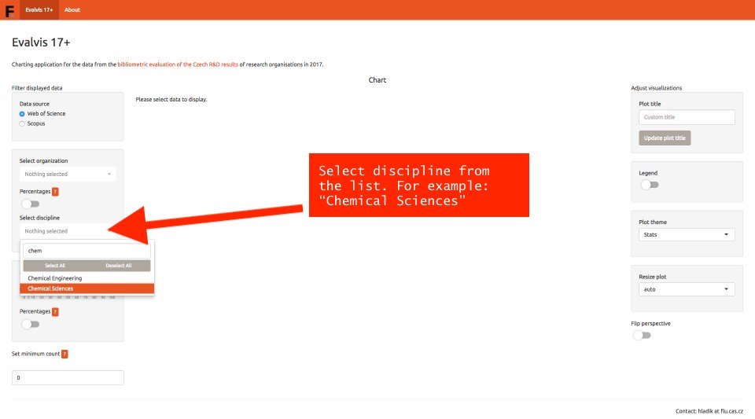
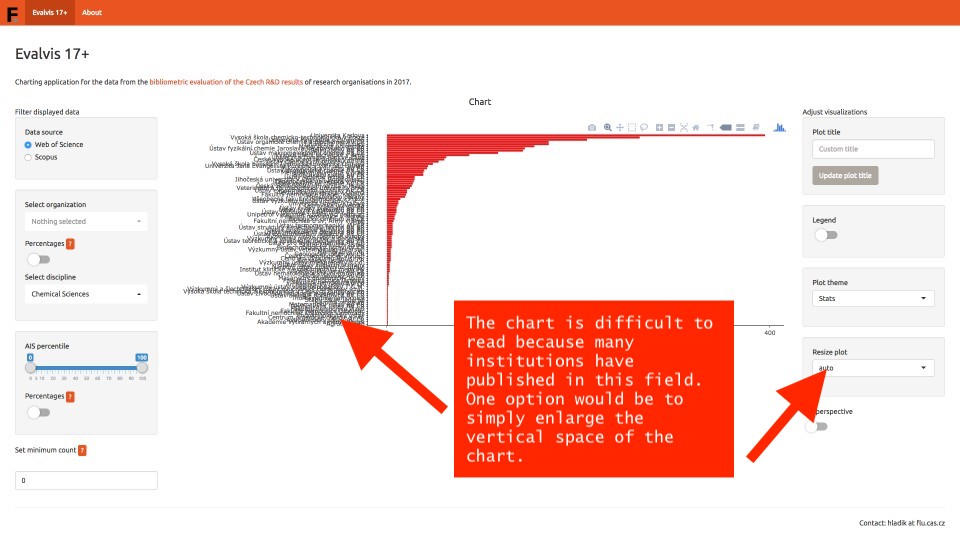
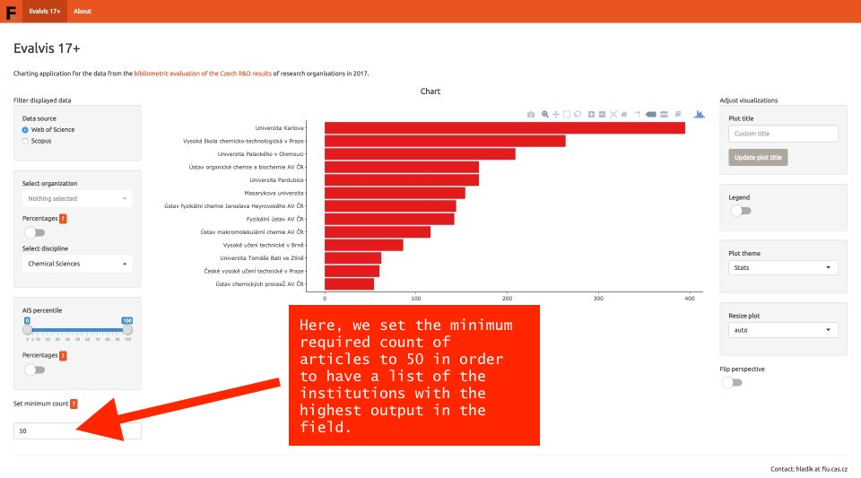
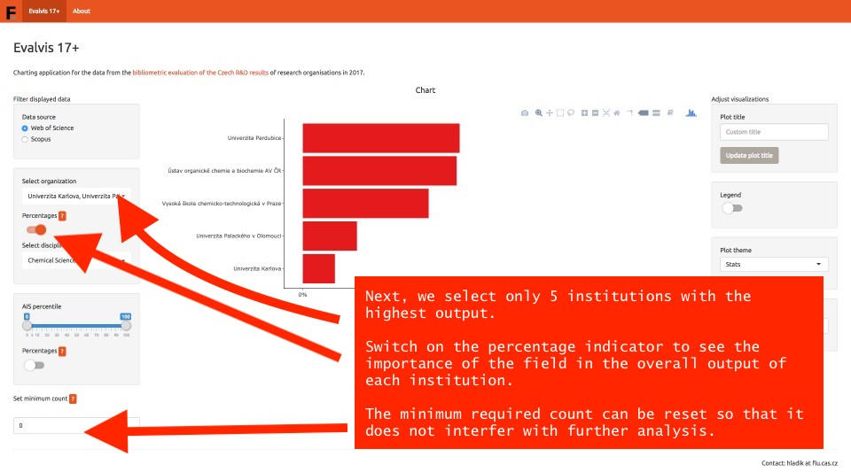
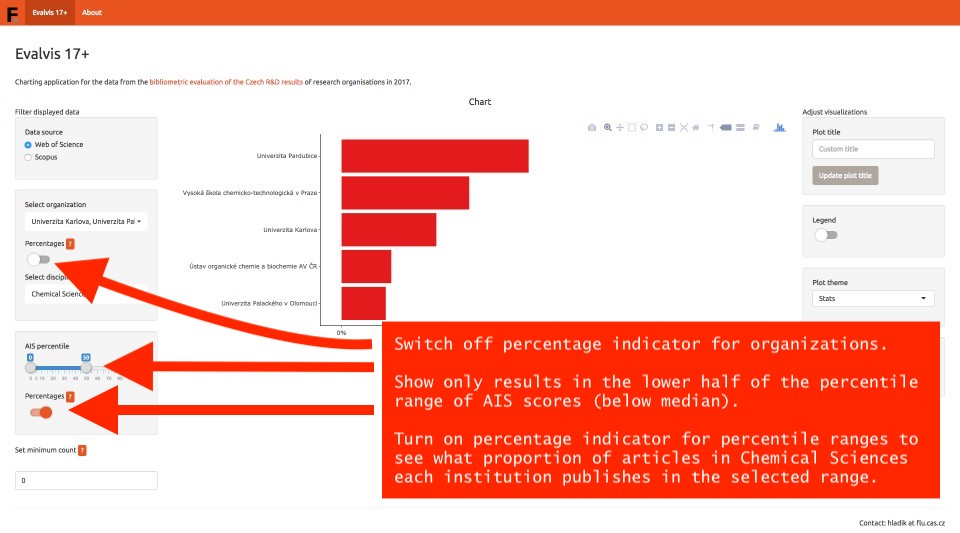
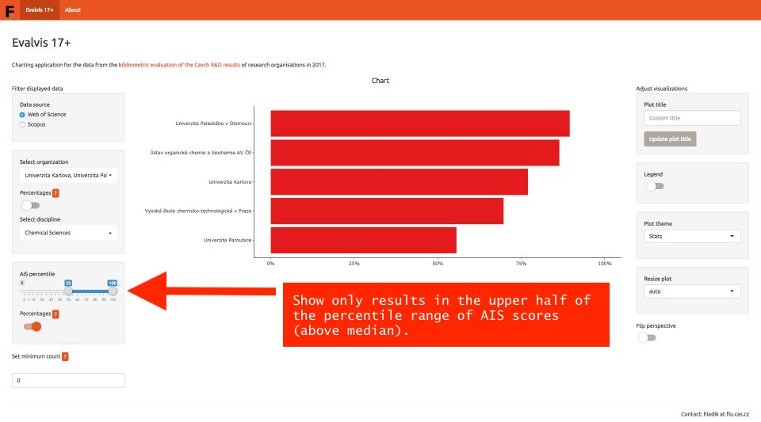
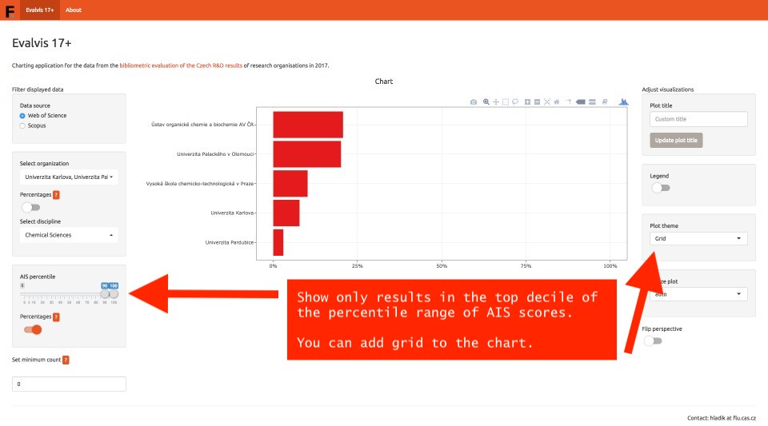
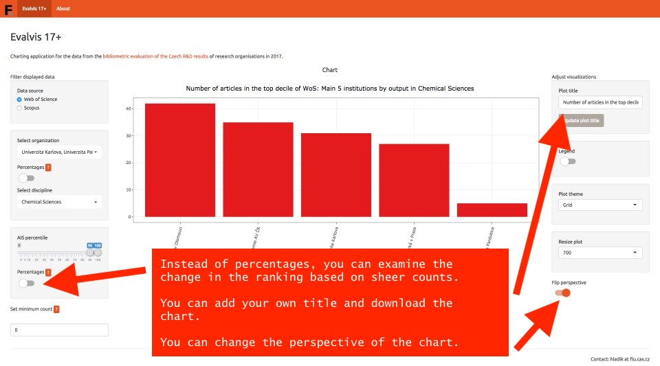

## About

#### Current release
version 0.1.2 (August 2019)  
- bugfix
version 0.1.1 (March 2019)

## Tutorial 

The tutorial will guide you through the process of analysing 
the structure of results in a particular discipline 
for the five organizations with the highest output.

1. [Selecting data](#selecting-data)
2. [Adjusting displayed chart](#adjusting-displayed-chart)
3. [Applying filters to data](#applying-filters)
4. [Changing units and combining data](#changing-units)
5. [Filtering data by AIS/SJR scores for each discipline](#filtering-data-by-score)
6. [Changing percentile ranges](#percentile-range)
7. [Theme selection](#theme-selection)
8. [Adding custom title and flipping chart perspective](#adding-custom-title)

  

#### Selecting data  

***
#### Adjusting displayed chart  

***

#### Applying filters to data 

***

#### Changing units and combining data 

***

#### Filtering data by AIS/SJR scores for each discipline 

***

#### Changing percentile ranges 

***

#### Adjusting chart by theme selection 

***

#### Adding custom title and flipping chart perspective

